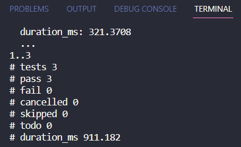

# Automatize os testes da sua API sem frameworks

Já pensou como seria testar sua api sem utilizar frameworks? Eu me perguntei isso após assistir um [vídeo](https://www.youtube.com/watch?v=Xyx_5F6IDqY&t=1264s) do [Erick Wendel](https://www.linkedin.com/in/erickwendel/) e caso tenha curiosidade em saber como ficaria, aqui está um exemplo!

## Esse projeto utiliza:

 - [ServeRest](https://github.com/ServeRest/ServeRest)
 - [Nodejs](https://nodejs.org/dist/latest-v18.x/docs/api)

## Como referência consultei:

 - [Assert](https://nodejs.org/dist/latest-v18.x/docs/api/assert.html)
 - [TestRunner](https://nodejs.org/dist/latest-v18.x/docs/api/test.html)

## Instalação ⚙️

Clone com git

```bash
git clone https://github.com/davisonalves/testing-without-frameworks.git
```
Instale as depedências da API a ser testada:
```bash
cd serverest
npm install
```
Ainda na pasta serverest, inicie a api:
```bash
npm run dev
```

## Rodando os testes 📃
*Na pasta raiz do projeto* ⬇️

Carregue o arquivo ".env" com:
```bash
source .env
```

Em seguida, rode o seguinte comando:

```bash
npm run test
```

Se tudo deu certo, você deve ver algo semelhante com isso:



## Nem tudo são rosas! (o que aprendi com esse projeto)

Apesar de gostar da ideia, pude ver o quanto os frameworks nos ajudam no dia a dia aumentando nossa produtividade, gastei boa parte do meu tempo nas funções que deixei na pasta utils para tentar deixar meus testes dinâmicos sem o uso do [faker](https://fakerjs.dev/) ou [chance](https://chancejs.com/) e ainda faltou validar os schemas da api de forma mais assertiva como o [joi](https://joi.dev/api/) faria, acabei fazendo apenas o basico no arquivo contract.test.js utilizando typeof de cada propriedade. Também quero comentar sobre o report do terminal, poderia utilizar [tap-spec](https://www.npmjs.com/package/tap-spec) para deixar algo mais bonito como Erick fez em seu vídeo, mas quis muito ver meu package.json sem depedências ahahahah

## Deixando de lado as críticas (o que foi dahora nesse projeto)

Conheci o testrunner do node e apesar de não estar perfeito, não dei falta de nada essencial e pude realizar meus testes normalmente com muita velocidade, o uso do fetch deixou minhas requisições super fáceis ao ponto de refletir se preciso mesmo do [supertest](https://www.npmjs.com/package/supertest) em minhas automações para testes de api. O Assert é legalzinho, mas imagino que seja mais útil para testes unitários, contudo foi legal conhecê-lo.